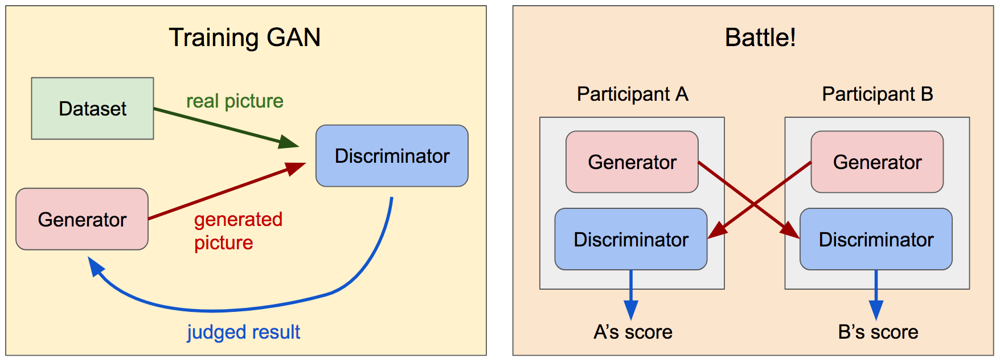
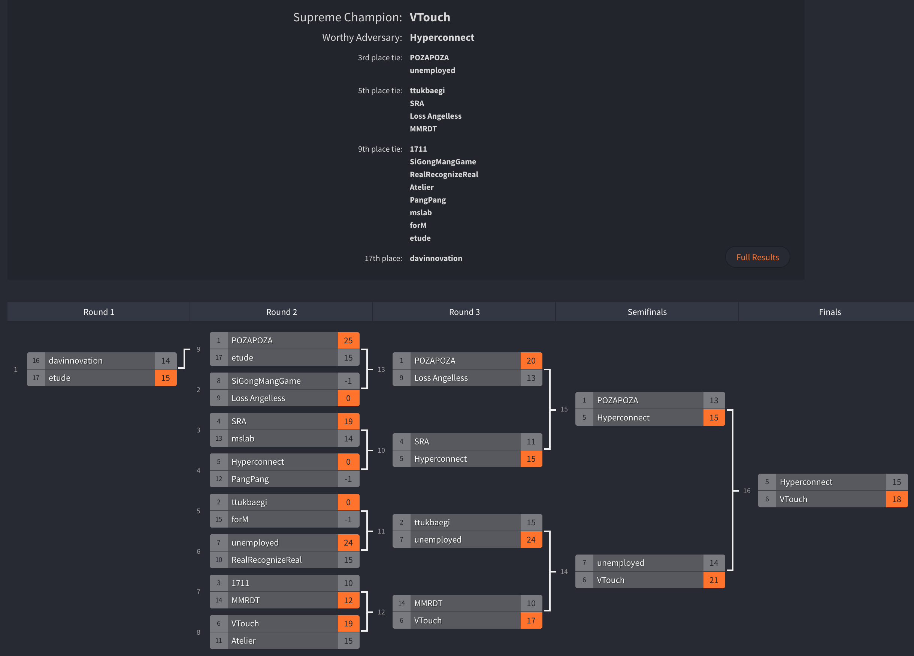
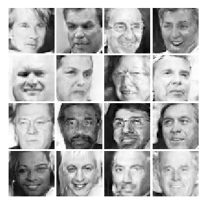
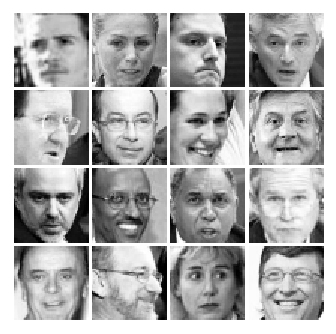

# Machine Learning Challenge 2017 Onsite Round Repository

This repository is about Machine Learning Challenge 2017 onsite round task, but contains the model which I implemented and trained after the contest.

The source code is originally from [mlc2017-onsite](https://github.com/machine-learning-challenge/mlc2017-onsite) and the further information can be found in [mlchallenge2017(ko)](https://mlchallenge2017.com/) and [google blog korea](https://korea.googleblog.com/2017/07/machine-learning-challenge.html)

## Summary

The contest is to make a GAN(Generative Adversarial Network) and compete with the other participants.

My teamname was `etude` and the result can be found [here](http://challonge.com/ohwnzusj).

## Model

My model is based on [DCGAN(Deep Convolutional Generative Adversarial Network)](https://arxiv.org/abs/1511.06434) with some tweaks.

## Result

After training this model (about 90k steps), some (fake) images from the generator is as follows.

While the original (training images or real images) images are as follows.

